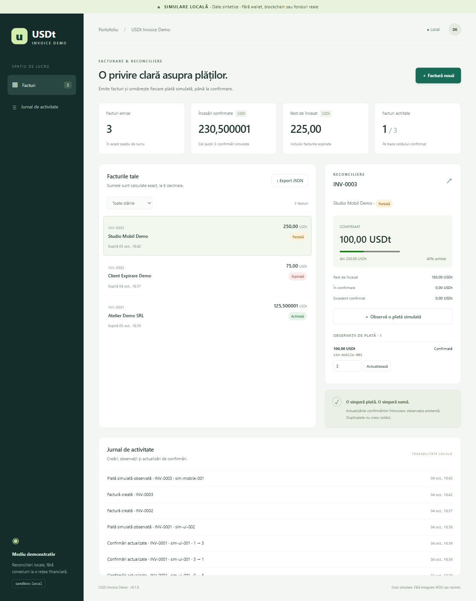
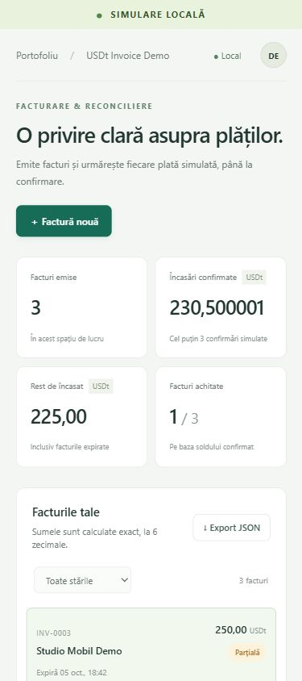

# USDt Invoice Demo

Dashboard local în română pentru **facturi și reconcilierea plăților USDt simulate**. Proiect de portofoliu separat de WDK Agent Payment Sandbox.

**Este exclusiv o simulare cu date sintetice. Fără wallet, seed, chei, WDK, testnet, mainnet, tranzacții sau fonduri reale.** Simularea este indicată permanent în interfață. Nu introduce date personale sau date financiare reale.

## Pornire Windows

Necesită Node.js **22 sau mai nou** disponibil în PATH; verificat cu Node 24.16.0 și npm 11.13.0. Nu se instalează software automat. Nu există dependențe npm externe, fonturi externe sau servicii cloud.

1. Extrage arhiva într-un folder nou.
2. Dublu clic pe **Porneste-demo.cmd**.
3. Deschide **http://127.0.0.1:4318** în browser. Fereastra de comandă trebuie să rămână deschisă.
4. Oprește cu **Ctrl+C**. Dacă portul este ocupat, oprește copia anterioară sau pornește într-un terminal cu un alt PORT.

Alternativ, din folderul proiectului:

```powershell
npm start
```

Datele sunt salvate atomic în `data/ledger.json`, creat la prima operație. Arhiva începe fără facturi; capturile și exportul de verificare arată numai scenarii sintetice executate în browser. Datele de lucru nu sunt incluse în arhivă. Exportă înainte de a muta sau înlocui folderul. Nu rula două servere simultan peste aceeași stocare: demo-ul nu implementează blocare între procese.

Port alternativ:

```powershell
$env:PORT='4319'
npm start
```

## Funcționalitate

- Creare facturi cu client sintetic, sumă și expirare în ora locală.
- Stări: **În așteptare, În confirmare, Parțială, Achitată, Expirată**.
- Valori pozitive, maximum 18 cifre înainte de punct și **maximum 6 zecimale**. Introducerea folosește punct, afișarea românească folosește virgulă. Nu se rotunjește și nu se folosește `Number` pentru solduri.
- Sume în micro-unități BigInt; JSON serializează sumele ca șiruri exacte.
- Prag fix: **3 confirmări simulate**. Plățile sub prag apar separat și nu reduc restul de încasat.
- Plăți parțiale, excedent confirmat și actualizarea confirmărilor. Scăderea sub prag elimină creditul din sold; factura poate reveni din Achitată în Parțială, În confirmare sau Expirată.
- ID global de observație. Duplicatul identic nu schimbă soldul sau jurnalul. Același ID cu altă sumă/factură este respins; actualizările schimbă numai confirmările.
- Token/rețea/destinatar sunt fixe și validate: `mock:USDt`, `sandbox:local`, `sim:merchant`. Formularul nu permite substituirea lor; API-ul respinge valorile greșite.
- Jurnal de modificări și export JSON complet. Interfața afișează cele mai recente 40 de evenimente; exportul include întregul jurnal.
- Interfață responsive, focus vizibil, etichete pentru controale, feedback de eroare și modal nativ.

## Scenariu rapid

1. Creează o factură de `100` USDt pentru un client sintetic, cu expirare mâine.
2. Selectează factura și „Observă o plată simulată”: ID `sim-001`, sumă `40`, confirmări `0` → În confirmare, rest `100`.
3. Actualizează la `3` confirmări → Parțială, confirmat `40`, rest `60`.
4. Actualizează din nou la `3` → duplicat ignorat, sold neschimbat.
5. Scade la `1` → confirmat `0`, rest `100`.
6. Revino la `3`; observă ID `sim-002`, sumă `65`, confirmări `3` → Achitată, excedent `5`.
7. Creează o factură fără plată cu expirare peste aproximativ 15 secunde. Așteaptă; starea se actualizează automat în Expirată când nu editezi un formular.
8. „Export JSON” descarcă facturile, observațiile, jurnalul și profilul explicit de simulare.

## Semantica expirării

Achitată are prioritate dacă suma confirmată acoperă factura. Altfel, după termen, starea este Expirată, inclusiv pentru facturi parțiale. Observațiile tardive sunt păstrate și reconciliate: nu ascundem o plată numai pentru că factura a expirat. Plata confirmată integral tardivă poate deveni Achitată. Expirarea este derivată din timp, nu o tranzacție înscrisă în jurnal. Confirmările sunt introduse manual și nu reprezintă finalitate blockchain.

## Testare și verificare

```powershell
npm ci --ignore-scripts --offline
npm test
npm run check
```

Nu este necesară conexiunea la internet pentru aceste comenzi. Testele Node folosesc ceas injectat, HTTP loopback și stocare temporară izolată. Nu se bazează pe portul aplicației, datele browserului sau fonduri. `check` verifică sintaxa JavaScript și câteva tipare nesigure/secrete; nu este un audit formal. Proiect JavaScript ESM, fără build sau TypeScript de pretins.

Rezultatele efectiv executate, remedierea testelor și verificările browserului sunt în [VERIFICARI.md](VERIFICARI.md). Capturi reale:





## Structură

```text
src/ledger.mjs       Model, validări, BigInt, reconciliere, jurnal
src/server.mjs       Server Node HTTP loopback, API, persistare atomică
public/             HTML, CSS, JavaScript în română, fără framework
tests/              Teste model, HTTP, stocare
scripts/check.mjs   Verificare sintaxă și tipare limitate
evidence/           Capturi reale, export sintetic, rezultate
Porneste-demo.cmd   Pornire Windows
data/               Stocare locală generată, exclusă din distribuție
```

## Limite și siguranță

Server legat numai la `127.0.0.1`, fără CORS; validare Host, Origin și Content-Type pentru scrieri, corp limitat la 16 KiB, CSP fără scripturi inline, text dinamic prin `textContent`. Nicio modificare a setărilor Windows. Stocarea se validează la pornire și eșuează închis dacă este invalidă; nu este suprascrisă automat pentru a ascunde corupția.

Demo pentru un singur utilizator/proces, fără autentificare, baze de date multi-user, taxe, curs valutar, import JSON, monitorizare de rețea sau recuperare economică reală. Limite: 500 facturi, 2000 observații, 10000 evenimente; la capacitate se resping scrieri noi, nu se șterg dovezi. Nu îl expune public și nu îl utiliza ca sistem de facturare financiară. Fără integrare WDK/testnet și fără certificare/audit de securitate.
